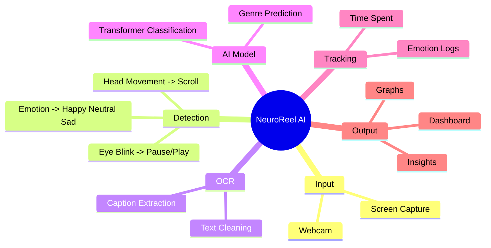
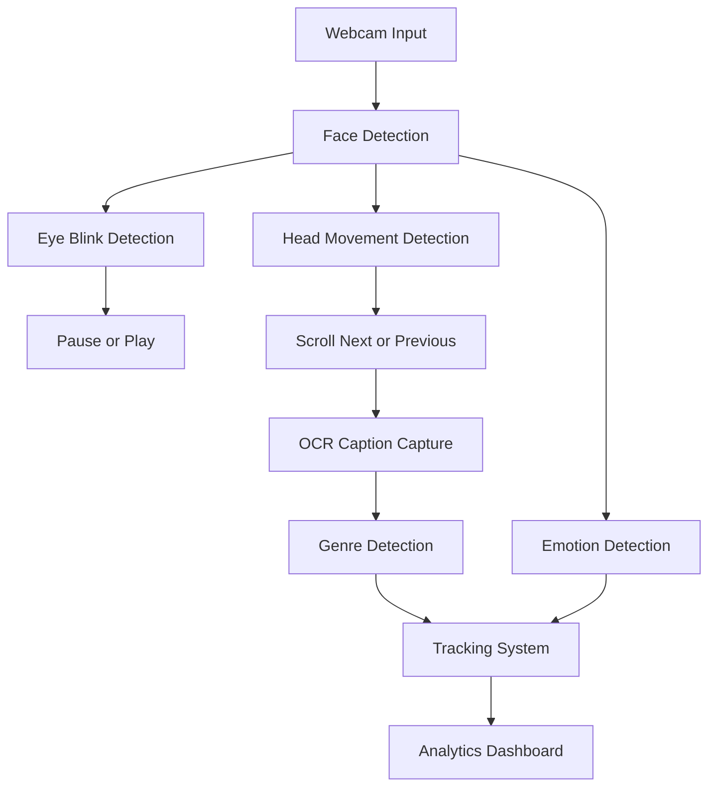

# 🧠 NeuroReel AI

> 🚀 AI-powered **Hands-Free YouTube Shorts Controller** with real-time analytics
> Built using **Computer Vision + AI + OCR + Emotion Tracking**

---


---

## 📛 Badges


---

## 🧠 Project Mindmap



---

## 🔄 Workflow



---

## 📂 Project Structure

```
neuroreel-ai/
│
├── app.py              ← Main controller
├── blink.py            ← Eye blink logic
├── head.py             ← Head movement logic
├── genre_ocr.py        ← OCR + genre detection
├── tracker.py          ← Data tracking
├── analytics.py        ← Dashboard generation
│
├── assets/
│   └── neuroreel.gif   ← Demo animation
│
├── requirements.txt
├── README.md
```

---

## ⚡ Features

* 👁️ Double Blink → Pause / Play
* 👤 Head Up / Down → Next / Previous Shorts
* 🧠 Emotion Detection (Happy / Neutral / Sad)
* 🔍 OCR-based Caption Analysis
* 🎯 Genre Classification using Transformers
* 📊 Auto-generated Analytics Dashboard
* ⚡ Real-time processing

---

## 🛠 Tech Stack

* Python
* OpenCV
* MediaPipe
* Transformers (HuggingFace)
* Tesseract OCR
* PyAutoGUI
* Matplotlib

---

## 🚀 Quickstart

### 1️⃣ Clone the repo

```bash
git clone https://github.com/Avinraj01/neuroreel-ai.git
cd neuroreel-ai
```

---

### 2️⃣ Create virtual environment

```bash
python3 -m venv env
source env/bin/activate
```

---

### 3️⃣ Install dependencies

```bash
pip install -r requirements.txt
```

---

### 4️⃣ Run project

```bash
python app.py
```

---

## 📊 Output

* 🎬 Hands-free Shorts control
* 🧠 Emotion tracking
* 📈 Graph (Emotion Trend)
* 📄 dashboard.html auto-generated

---

## 🧠 Future Improvements

* 🎙 Voice command support
* 📱 Mobile integration
* ☁️ Cloud dashboard
* 🤖 Better emotion accuracy

---

## 🤝 Contributing

1. Fork this repo
2. Create a branch (`git checkout -b feature-name`)
3. Commit (`git commit -m "New feature"`)
4. Push (`git push origin feature-name`)
5. Open Pull Request 🚀

---

## 📜 License

MIT License

---


---
✨ *AI + Vision + Automation = Future Interaction* ✨
